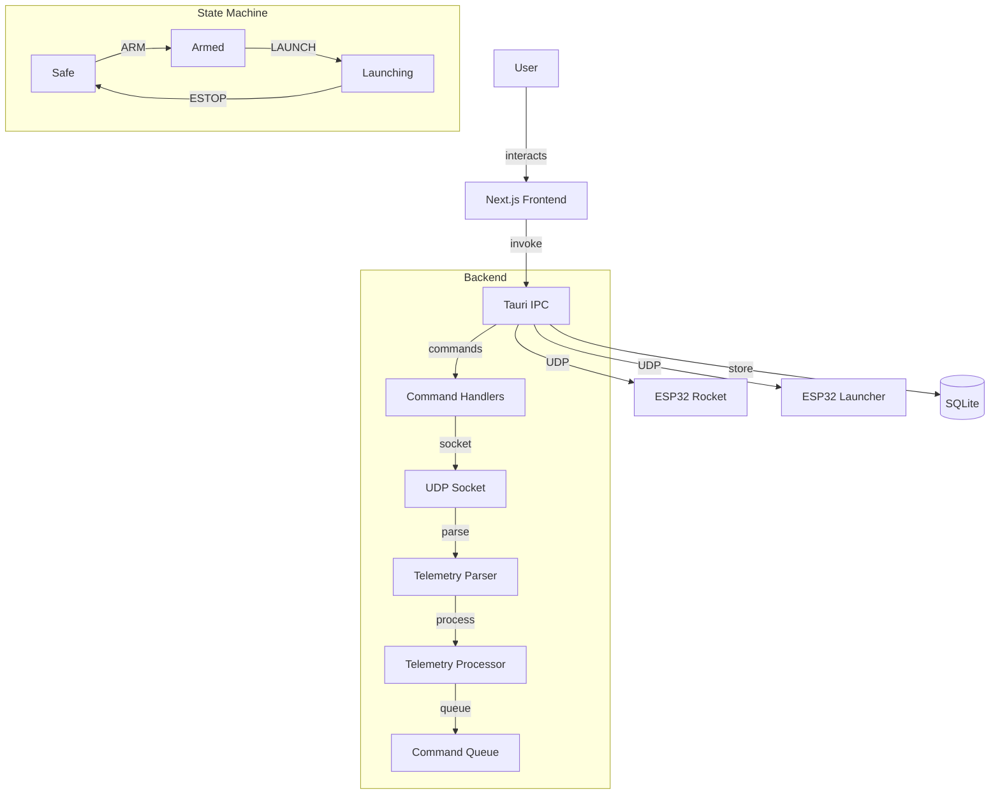

# MANPADS Control Panel

A professional-grade macOS desktop application for managing the MANPADS guided rocket & launcher system.

## Quick Start

```bash
# 1. Clone and install
git clone https://github.com/your-repo/MANPADS-System-Launcher-and-Rocket.git
cd MANPADS-System-Launcher-and-Rocket/manpads-control
npm install

# 2. Start development
npm run dev
```

**That's it!** The app launches with hot-reload. Build for production with `npm run build`.

---

## Architecture

---

## Architecture



### State Machine Flow

```
Safe → Calibrating → Armed → Launching → Firing → Recovering
  ↑        ↓           ↓        ↓          ↓          ↓
  └────────┴───────────┴────────┴──────────┴──────────┘ (EmergencyStop from any state)
```

## Features

- **Real-time Telemetry Dashboard** - Monitor rocket roll angle, rotation rate, servo output, GPS coordinates, altitude, and more
- **PID Controller Tuning** - Live adjustment of Kp/Kd parameters with visual feedback
- **Launch Sequence Wizard** - Safe 3-step launch procedure with hardware interlocks
- **Emergency Stop** - Always-visible emergency stop button for immediate shutdown
- **Flight Log Storage** - SQLite-backed local storage with CSV export
- **UDP Communication** - Native UDP socket communication with launcher hardware

## Tech Stack

- **Backend**: Rust (Tauri 2.0)
- **Frontend**: Next.js 14 + React 18 + TypeScript
- **Styling**: TailwindCSS with Supabase-inspired design system
- **State Management**: Zustand
- **Database**: SQLite (rusqlite)
- **Communication**: UDP sockets via tokio

## Getting Started

### Prerequisites

- macOS 11.0+ (Apple Silicon optimized)
- Rust 1.70+
- Node.js 18+
- npm or pnpm

### Installation

```bash
# Clone the repository
git clone <repository-url>
cd MANPADS-System-Launcher-and-Rocket/manpads-control

# Install dependencies
npm install

# Start development server
npm run dev
```

### Building for Production

```bash
# Build the Tauri application
npm run build
```

This creates a `.dmg` installer in `src-tauri/target/release/bundle/dmg/`.

## Project Structure

```
manpads-control/
├── src/                          # Next.js frontend
│   ├── app/                      # App Router
│   │   ├── layout.tsx            # Root layout
│   │   ├── page.tsx              # Main dashboard
│   │   └── globals.css           # Global styles + Tailwind
│   ├── components/
│   │   ├── ui/                   # Reusable UI components
│   │   │   ├── Button.tsx
│   │   │   ├── Card.tsx
│   │   │   ├── Gauge.tsx
│   │   │   └── ErrorBoundary.tsx
│   │   ├── telemetry/             # Telemetry display
│   │   │   └── TelemetryDashboard.tsx
│   │   └── control/              # Control panels
│   │       ├── ConnectionPanel.tsx
│   │       ├── PidEditor.tsx
│   │       ├── LaunchWizard.tsx
│   │       └── EmergencyStopButton.tsx
│   ├── hooks/                    # Custom React hooks
│   ├── store/                    # Zustand state management
│   │   └── telemetry.ts
│   └── lib/                      # Utilities
│       ├── types.ts              # TypeScript types
│       ├── constants.ts          # App constants
│       └── utils.ts              # Utility functions
├── src-tauri/                    # Rust backend
│   ├── src/
│   │   ├── main.rs              # Entry point
│   │   ├── lib.rs               # Shared types
│   │   └── backend/
│   │       ├── udp/             # UDP socket + parser
│   │       ├── storage/         # SQLite repository
│   │       └── commands/        # Tauri IPC commands
│   ├── Cargo.toml
│   └── tauri.conf.json
├── .github/workflows/           # CI/CD
├── tailwind.config.js           # Tailwind configuration
└── package.json
```

## Usage

### Connecting to Hardware

1. Power on the MANPADS launcher
2. The launcher creates a WiFi AP named `ROCKET_LAUNCHER`
3. In the app, enter the IP address (default: `192.168.4.1`) and port (`4444`)
4. Click **Connect**

### Launch Sequence

1. **System Test** - Click "Start System Test" to verify connectivity
2. **Arm** - Click "ARM" then "CONFIRM ARM" to arm the system
3. **Launch** - Click "LAUNCH" after the 3-second countdown

### Adjusting PID Values

Use the sliders to adjust Kp (0-10) and Kd (0-5) values. Changes are sent in real-time to the rocket's flight controller.

### Exporting Flight Data

Flight logs are stored locally in `~/Library/Application Support/manpads-control/`. Export to CSV via the flight log panel.

## Keyboard Shortcuts

| Shortcut | Action |
|----------|--------|
| `Cmd+L` | Launch |
| `Esc` | Emergency Stop |
| `Cmd+D` | Disconnect |

## Design System

Follows the Supabase-inspired dark mode design:

| Token | Value | Usage |
|-------|-------|-------|
| Background | `#171717` | Page canvas |
| Background Deep | `#0f0f0f` | Buttons, surfaces |
| Text Primary | `#fafafa` | Main text |
| Text Secondary | `#b4b4b4` | Secondary text |
| Text Muted | `#898989` | Labels, captions |
| Brand Green | `#3ecf8e` | Accents, success |
| Border | `#2e2e2e` | Card borders |
| Crimson | `#ef4444` | Errors, danger |

### Typography

- **Circular** - Body text, UI elements
- **Source Code Pro** - Code labels, technical values

## Troubleshooting

### Connection Issues

- Verify the launcher is powered on
- Ensure you're connected to the launcher's WiFi network
- Check that the IP address matches the launcher's AP (default: `192.168.4.1`)
- Verify port `4444` is not blocked by firewall

### Serial Permission Errors (Linux)

```bash
# Add user to dialout group
sudo usermod -a -G dialout $USER
# Log out and back in
```

### macOS Permission Errors

If prompted, grant network access in **System Preferences → Security & Privacy → Firewall**.

### Build Errors

- Ensure Rust 1.70+ is installed: `rustc --version`
- Update dependencies: `cargo update` in `src-tauri/`
- Clear build cache: `cargo clean` in `src-tauri/`

### Missing Dependencies

```bash
# Install Rust
curl --proto '=https' --tlsv1.2 -sSf https://sh.rustup.rs | sh

# Install Node.js 18+
nvm install 18
nvm use 18

# Install system packages for Tauri
# macOS
xcode-select --install
```

## Contributing

1. Fork the repository
2. Create a feature branch (`git checkout -b feature/amazing-feature`)
3. Commit changes (`git commit -m 'Add amazing feature'`)
4. Push to branch (`git push origin feature/amazing-feature`)
5. Open a Pull Request

## License

MIT License - see LICENSE file for details.

## Acknowledgments

- Supabase for the design system inspiration
- Tauri team for the excellent desktop framework
- Next.js team for the React framework